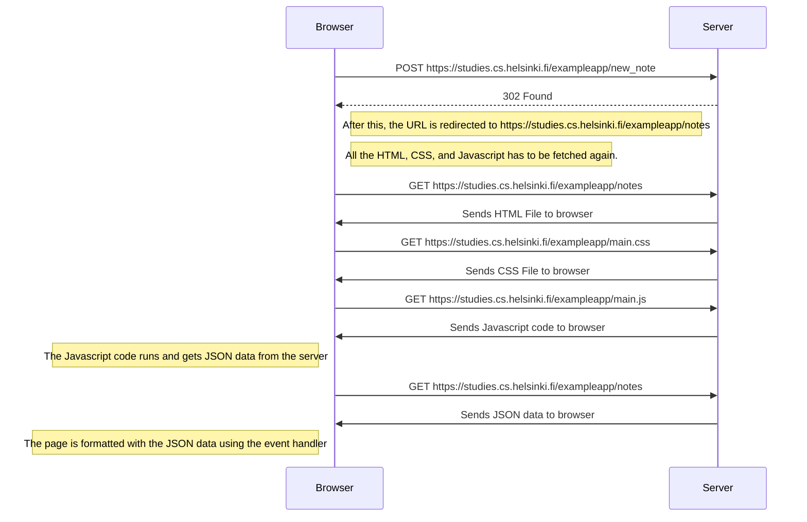

```mermaid
    sequenceDiagram
    participant Browser
    participant Server
    Browser ->> Server: POST https://studies.cs.helsinki.fi/exampleapp/new_note
    Server -->> Browser: 302 Found
    note right of Browser: After this, the URL is redirected to https://studies.cs.helsinki.fi/exampleapp/notes
    note right of Browser: All the HTML, CSS, and Javascript has to be fetched again.
    Browser ->> Server: GET https://studies.cs.helsinki.fi/exampleapp/notes
    Server ->> Browser: Sends HTML File to browser
    Browser ->> Server: GET https://studies.cs.helsinki.fi/exampleapp/main.css
    Server ->> Browser: Sends CSS File to browser
    Browser ->> Server: GET https://studies.cs.helsinki.fi/exampleapp/main.js
    Server ->> Browser: Sends Javascript code to browser
    note left of Browser: The Javascript code runs and gets JSON data from the server
    Browser ->> Server: GET https://studies.cs.helsinki.fi/exampleapp/notes
    Server ->> Browser: Sends JSON data to browser
    note left of Browser: The page is formatted with the JSON data using the event handler
```