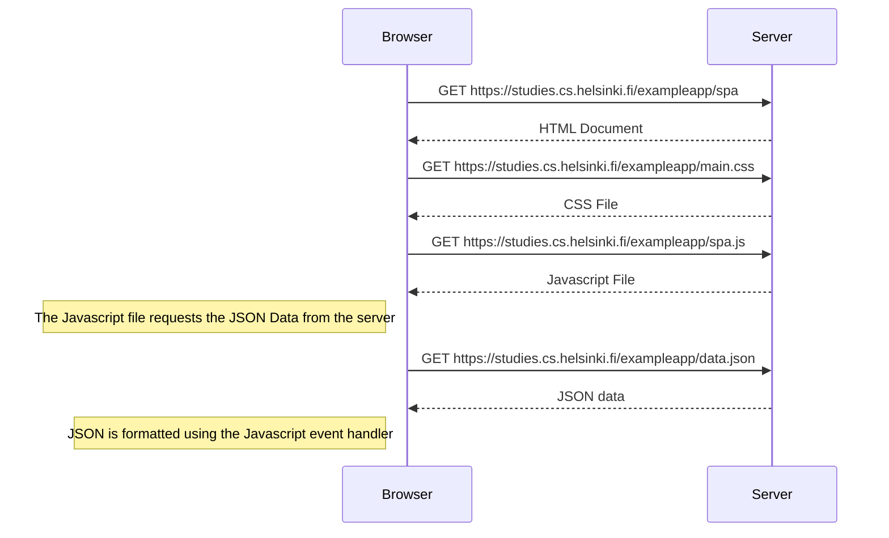

```mermaid
    sequenceDiagram
    participant Browser
    participant Server

    Browser ->> Server: GET https://studies.cs.helsinki.fi/exampleapp/spa
    Server -->> Browser: HTML Document
    Browser ->> Server: GET https://studies.cs.helsinki.fi/exampleapp/main.css
    Server -->> Browser: CSS File
    Browser ->> Server: GET https://studies.cs.helsinki.fi/exampleapp/spa.js
    Server -->> Browser: Javascript File
    note left of Browser: The Javascript file requests the JSON Data from the server
    Browser ->> Server: GET https://studies.cs.helsinki.fi/exampleapp/data.json
    Server -->> Browser: JSON data
    note left of Browser: JSON is formatted using the Javascript event handler
```